### Implement a Client Server Architecture using MySQL Database Management System (DBMS)

Implementing a client-server architecture using the MySQL Database Management System (DBMS) involves setting up the server to host the MySQL database and the client to interact with this database.

### Step 1: Create instance
1. Two EC2 instances of the t2.micro type, running Ubuntu 24.04 LTS (HVM), were launched in the us-east-1 region using the AWS console. One instance is designated for the client and the other for the server. The security group inbound rule for both instances was configured with the default SSH access on port 22, allowing connections from any IP address.

### Step 2: Connect Server instance 
1. connect to the server instance
```
ssh -i <pem key> Ubuntu@publicIP
```
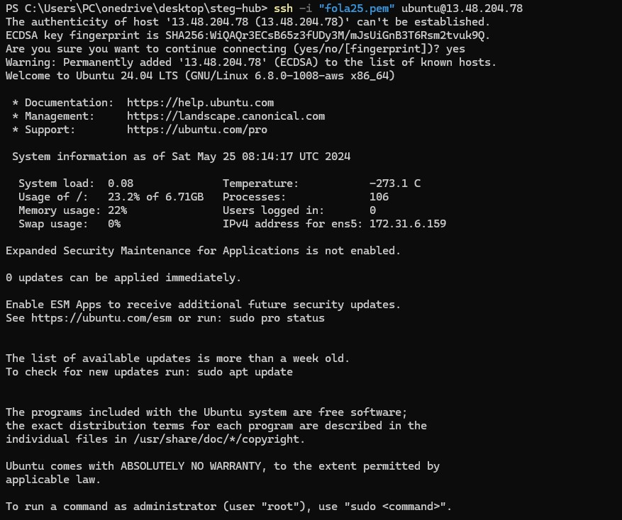

2. Update and upgrade Ubuntu
```
sudo apt update
sudo apt upgrade -y
```

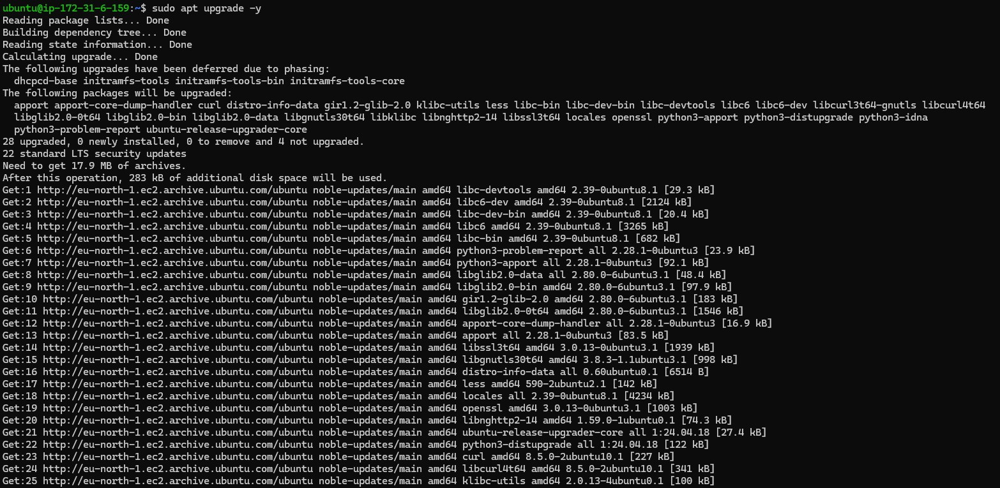

3. Install MySQL Server software
```
sudo apt install mysql-server -y
```
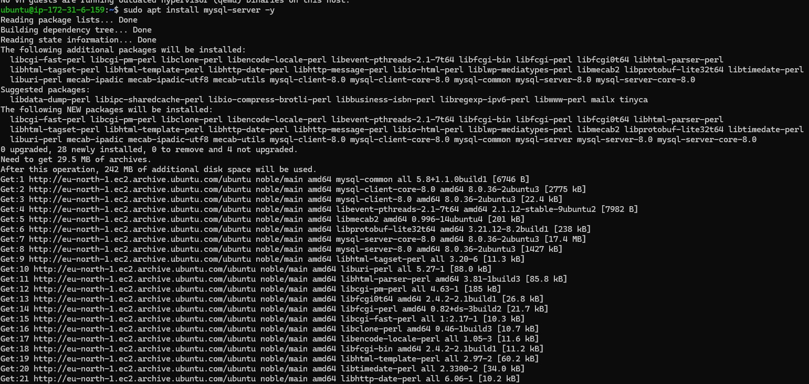

4. Enable the server
```
sudo systemctl enable mysql
```
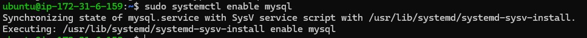 


### Step 3: Connect Client instance
1. Connect to Client instance
```
ssh -i <pem key> Ubuntu@publicIP
```
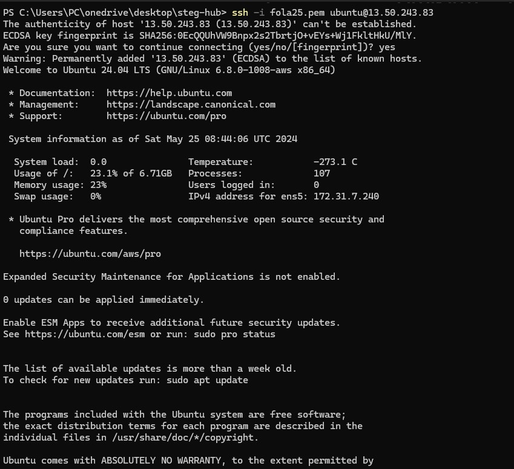

2. Update and upgrade ubuntu
```
sudo apt update
sudo apt upgrade -y
```
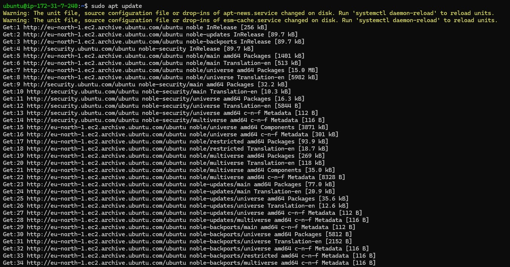
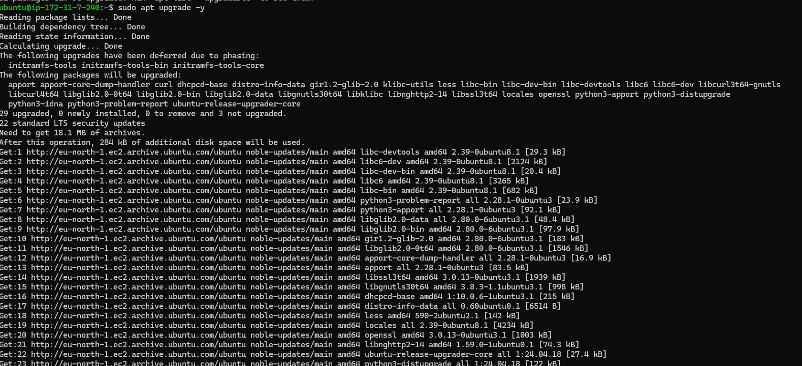

3. Install MySQL Client software
```
sudo apt install mysql-client -y
```
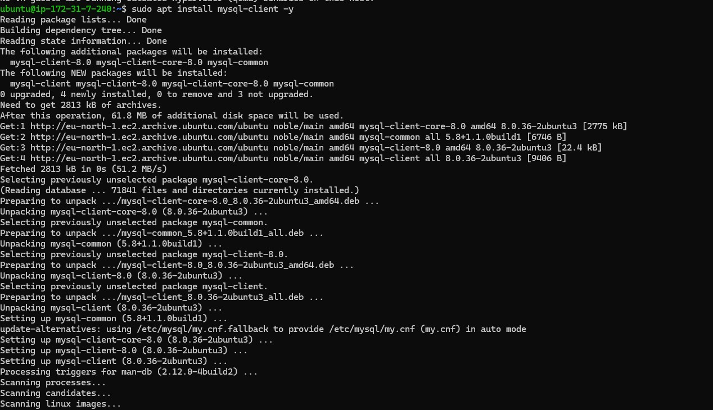

### Step 4: connect server instance to client instance

By default, both EC2 virtual servers are located in the same local virtual network, allowing them to communicate with each other using local IP addresses. To connect from the MySQL client to the MySQL server, use the MySQL server's local IP address. Since MySQL server uses TCP port 3306 by default, you must open this port by creating a new entry in the inbound rules of the MySQL server's Security Group. For extra security, access to the MySQL server is restricted to the specific local IP address of the MySQL client, rather than allowing access from all IP addresses.
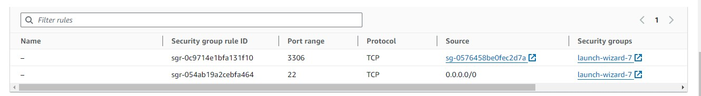

### Step 5: Configure MySQL server to allow connections from remote hosts.
1. Run security script of Mysql on server instance
```
sudo mysql_secure_installation
```
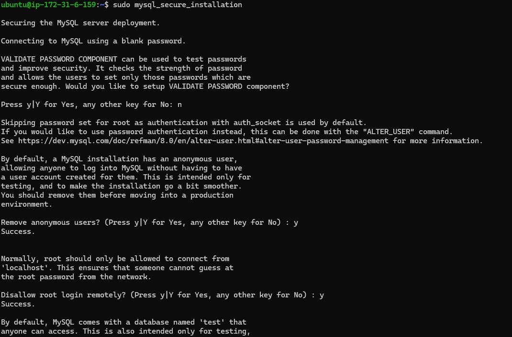

2. Access Mysql
```
sudo mysql
```

3. Create a user named ```client``` and a database named ```test_db```.
```
CREATE USER 'client'@'%' IDENTIFIED WITH mysql_native_password BY 'Ademola.1234';

CREATE DATABASE test_db;

GRANT ALL ON test_db.* TO 'client'@'%' WITH GRANT OPTION;

FLUSH PRIVILEGES;
```
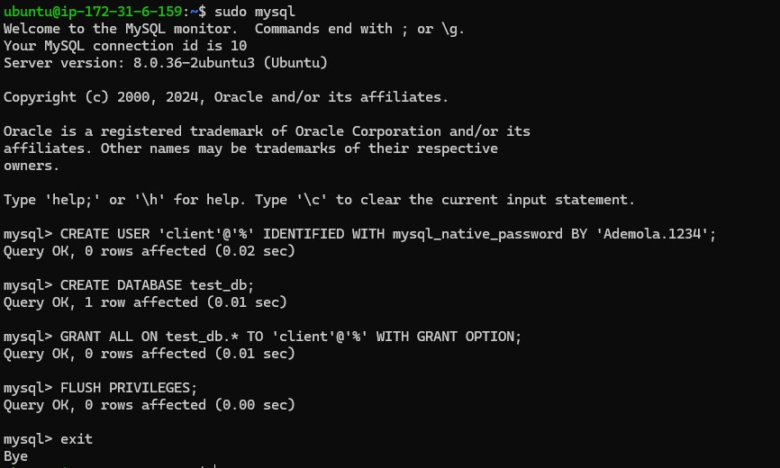

4. Configure MySQL server to allow connections from remote hosts. Locate ```bind-address = 127.0.0.1``` and replace ```127.0.0.1``` with ```0.0.0.0```
```
sudo vim /etc/mysql/mysql.conf.d/mysqld.cnf
```
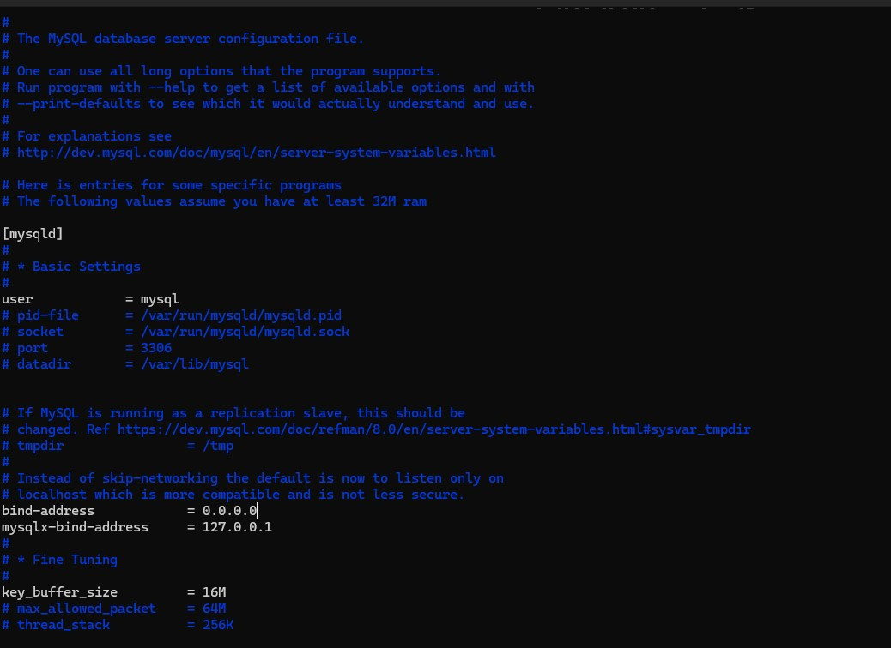

### Step 6: 
1. From the MySQL client Linux server, connect remotely to the MySQL server Database Engine without using SSH. Use the ```mysql``` utility to perform this action.
```
sudo mysql -u client -h 172.31.7.159 -p
```
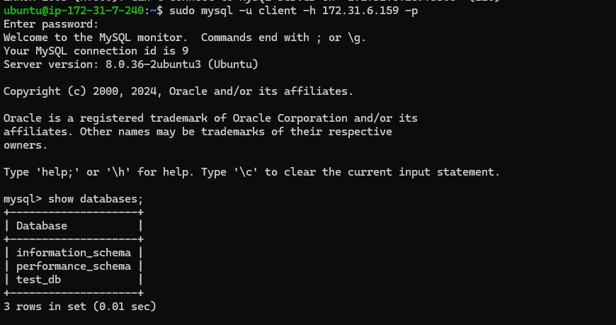

2. Check that the connection to the remote MySQL server was successfull and can perform SQL queries.
```
show databases;
```


3. Create table, insert rows into table and select from the table
```
CREATE TABLE test_db.test_table (
  item_id INT AUTO_INCREMENT,
  content VARCHAR(255),
  PRIMARY KEY(item_id)
);

INSERT INTO test_db.test_table (content) VALUES ("This task stressed me more than i expected");

INSERT INTO test_db.test_table (content) VALUES ("I spent a large amount of time on this task");

SELECT * FROM test_db.test_table;
```