#DEVOPS TOOLING WEBSITE SOLUTION
### Step 1: Set up the NfS server
1. Create an instance for the NFS server
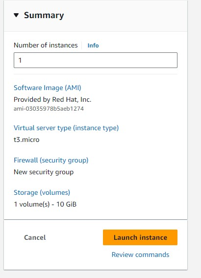

2. Create 3 volumes in the same AZ as the NFS Server ec2 each of 10GB and attache all 3 volumes one by one to the NFS Server.

3. Connect to the instance from the local machine
```
ssh <pemkey> ec2-user@<ip_address>
```

4. Run ```lsblk``` to check the volumes created
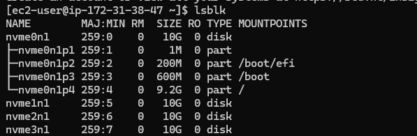

6. Partition each volume using
```
sudo gdisk /dev/nvme1n1
sudo gdisk /dev/nvme2n1
sudo gdisk /dev/nvme3n1
```
follow the prompt to create the partion. ('n' and 'w')
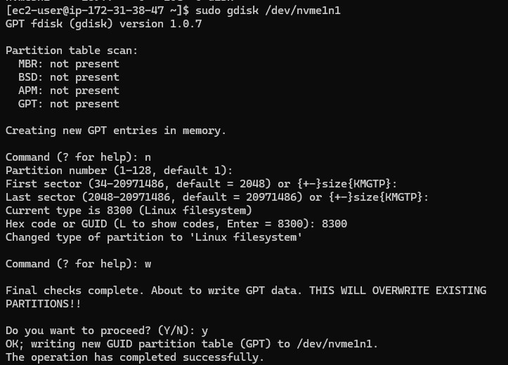

7. Install lvm package
```
sudo yum install lvm2 -y
```

8. Use ```pvcreate``` utility to mark each of the 3 dicks as physical volumes (PVs) to be used by LVM. Verify that each of the volumes have been created successfully
```
sudo pvcreate /dev/nvme1n1p1 /dev/nvme2n1p1 /dev/nvme3n1p1
sudo pvs
```

9. Use ```vgcreate``` utility to add all 3 PVs to a volume group (VG). Name the VG ````webdata-vg```. Verify that the VG has been created successfully
```
sudo vgcreate webdata-vg /dev/nvme1n1p1 /dev/nvme2n1p1 /dev/nvme3n1p1
sudo vgs
```

10. Use ```lvcreate``` utility to create 3 logical volume, ```lv-apps```, ```lv-logs``` and ```lv-opt```. Verify that the logical volumes have been created successfully
```
sudo lvcreate -n lv-apps -L 9G webdata-vg
sudo lvcreate -n lv-logs -L 9G webdata-vg
sudo lvcreate -n lv-opt -L 9G webdata-vg

sudo lvs
```

11. Check the complete setup
```
sudo vgdisplay -v
```
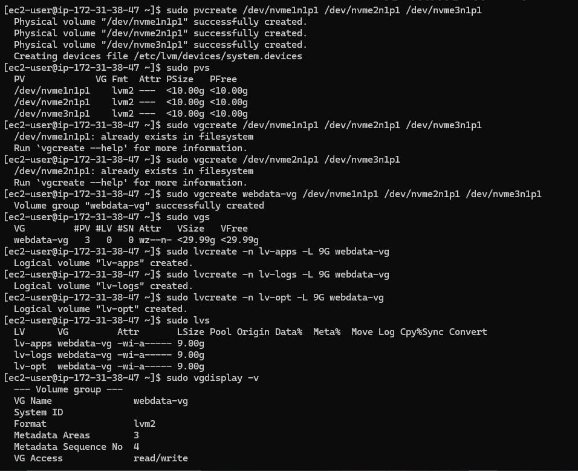

12. Use ```mkfs -t xfs``` to format the logical volumes instead of ext4 filesystem
```
sudo mkfs -t xfs /dev/webdata-vg/lv-apps
sudo mkfs -t xfs /dev/webdata-vg/lv-logs
sudo mkfs -t xfs /dev/webdata-vg/lv-opt
```

13. Create mount point on /mnt directory
```
sudo mkdir /mnt/apps
sudo mkdir /mnt/logs
sudo mkdir /mnt/opt
```

```
sudo mount /dev/webdata-vg/lv-apps /mnt/apps
sudo mount /dev/webdata-vg/lv-logs /mnt/logs
sudo mount /dev/webdata-vg/lv-opt /mnt/opt
```

14. Install NFS Server, configure it to start on reboot and ensure it is up and running.
```
sudo yum update -y
sudo yum install nfs-utils -y
```

```
sudo systemctl start nfs-server.service
sudo systemctl enable nfs-server.service
sudo systemctl status nfs-server.service
```
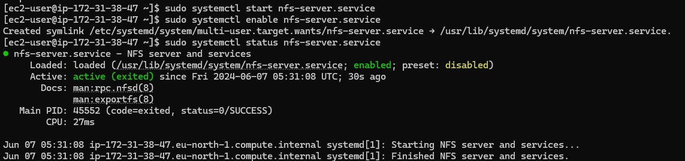

15. Export the mounts for Webservers' subnet cidr(IPv4 cidr) to connect as clients. For simplicity, all 3 Web Servers are installed in the same subnet but in production set up, each tier should be separated inside its own subnet or higher level of security. Set up permission that will allow the Web Servers to read, write and execute files on NFS.
```
sudo chown -R nobody: /mnt/apps
sudo chown -R nobody: /mnt/logs
sudo chown -R nobody: /mnt/opt

sudo chmod -R 777 /mnt/apps
sudo chmod -R 777 /mnt/logs
sudo chmod -R 777 /mnt/opt

sudo systemctl restart nfs-server.service
```

16. Configure access to NFS for clients within the same subnet
```
sudo vi /etc/exports

/mnt/apps 172.31.16.0/20(rw,sync,no_all_squash,no_root_squash)
/mnt/logs 172.31.16.0/20(rw,sync,no_all_squash,no_root_squash)
/mnt/opt 172.31.16.0/20(rw,sync,no_all_squash,no_root_squash)

sudo exportfs -arv
```
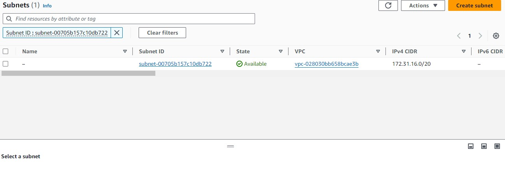

17. Check which port is used by NFS and open it using the security group (add new inbound rule)
```
rpcinfo -p | grep nfs
```
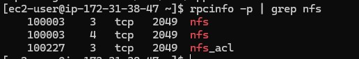

18. For NFS Server to be accessible from the client, the following ports must be opened: TCP 111, UDP 111, UDP 2049, NFS 2049. Set the Web Server subnet cidr as the source.
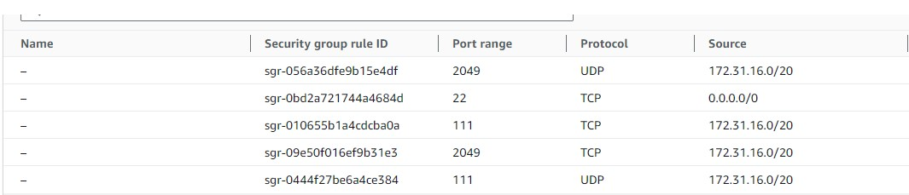

### Step 2 - Configure the Database Server
1. Launch an Ubuntu EC2 instance that will handle the database. 
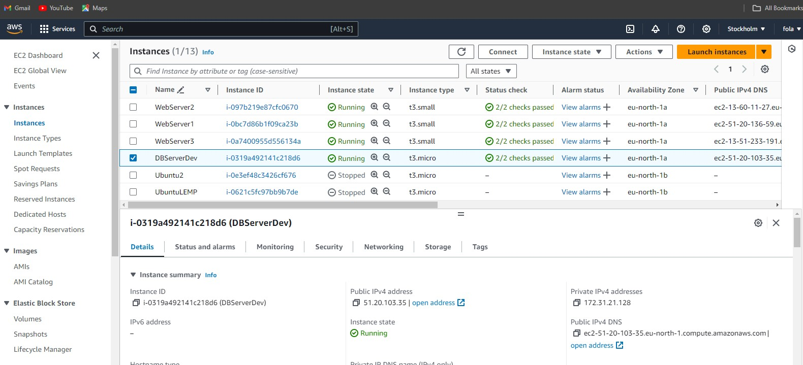

2. Log into the server using the ssh key. Update and upgrade server.

3. Install MySQL Server using and run mysql secure script.

4. Create a database ```tooling``` and a database user ```webaccess```. Grant permission to ```webaccess``` user on ```tooling``` database to do anything only from the webservers subnet cidr.
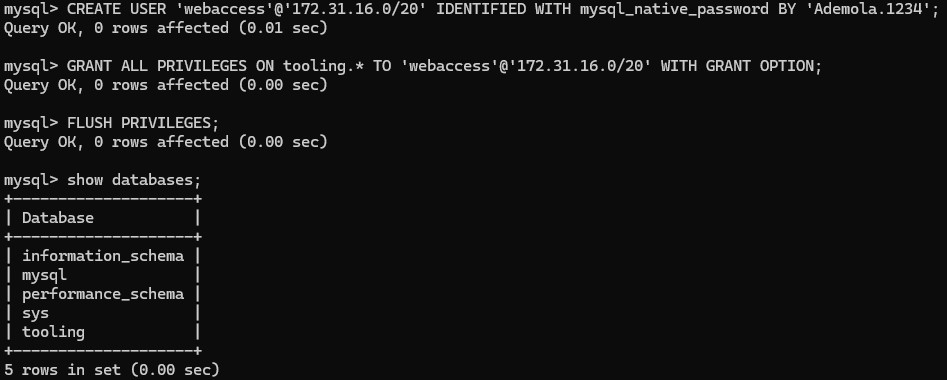
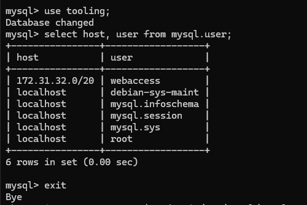

5. Set Bind Address to ```0.0.0.0``` to allow access from anywhere and restart MySQL.
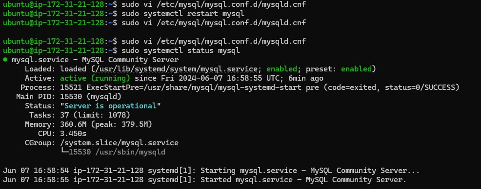

6. Open MySQL port 3306 on the DB Server EC2 with access allowed only from the Subnet Cidr configured as source.
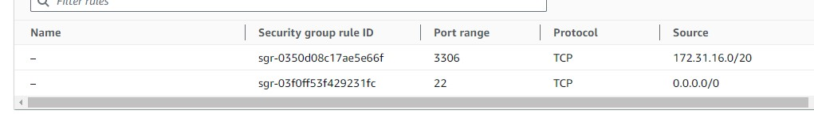

### Step 3 - Prepare the Web Servers
1. Launch 3 RedHeart instances
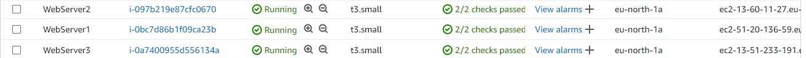

2. Install NFS Client
```
sudo yum install nfs-utils nfs4-acl-tools -y
```
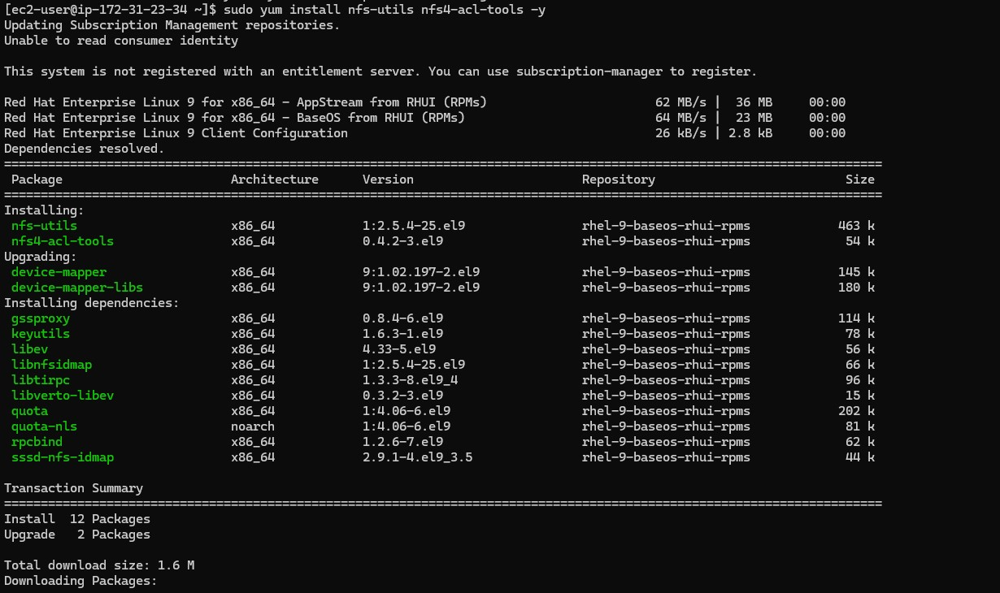

3. Mount /var/www/ and target the NFS server's export for apps.
```
sudo mkdir /var/www
sudo mount -t nfs -o rw,nosuid 172.31.38.47:/mnt/apps /var/www
```
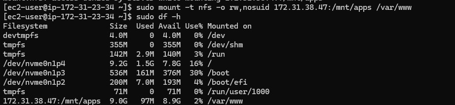

4. Open the fstab file and edit permission
```
sudo vi /etc/fstab

#add line to the code in the file
172.31.38.47:/mnt/apps /var/www nfs defaults 0 0

172.31.38.47:/mnt/apps /var/www nfs defaults 0 0 #For Server 3
```

5.  Install Remi's repoeitory, Apache and PHP
```
sudo yum install httpd -y
sudo dnf install https://dl.fedoraproject.org/pub/epel/epel-release-latest-9.noarch.rpm
sudo dnf install dnf-utils http://rpms.remirepo.net/enterprise/remi-release-9.rpm
sudo dnf module reset php
sudo dnf module enable php:remi-8.2
sudo dnf install php php-opcache php-gd php-curl php-mysqlnd

sudo systemctl start php-fpm
sudo systemctl enable php-fpm
sudo systemctl status php-fpm

sudo setsebool -P httpd_execmem 1  # Allows the Apache HTTP server (httpd) to execute memory that it can also write to. This is often needed for certain types of dynamic content and applications that may need to generate and execute code at runtime.
sudo setsebool -P httpd_can_network_connect=1   # Allows the Apache HTTP server to make network connections to other servers.
sudo setsebool -P httpd_can_network_connect_db=1  # allows the Apache HTTP server to connect to remote database servers.
```
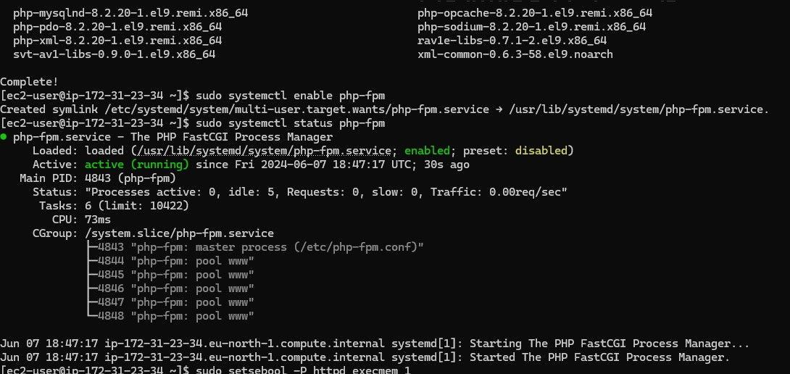

6. Repeat the process and installations for the other 2 instances.

7. Verify if ```/var/www ``` of the web servers and ```/mnt/apps``` of the Nfs server contain the same files.  create ```test.txt``` on server 1 and grant it access on server 2.

8. Fork the tooling source code from StegHub GitHub Account
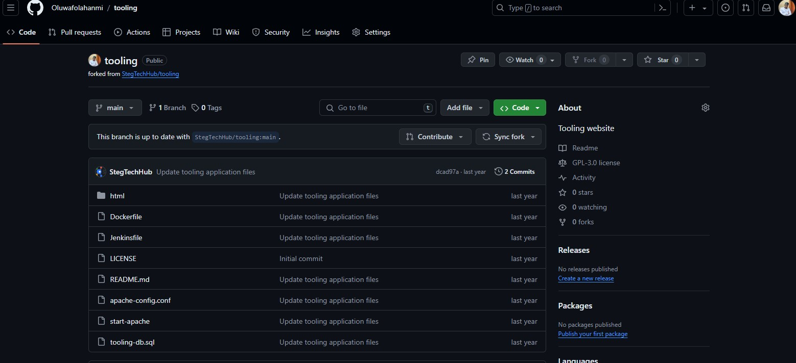

10. Install Git, initialize the directory and clone the forked repository.
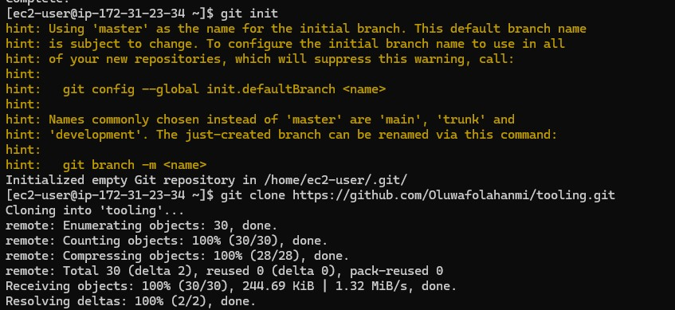

11. Copy the content of the ```tooling/html``` to ```var/www/html```
```
sudo cp -R html/. /var/www/html
```

12. Open selinux file and disable selinux
```
sudo vi /etc/sysconfig/selinux

SELINUX=disabled

sudo systemctl restart httpd
```

13. Update the website's configuration to connect to the database. Apply tooling-db.sql. Access the database from the webserver.
```
sudo vi /var/www/html/functions.php
sudo mysql -h 172.31.21.128 -u webaccess -p tooling < tooling-db.
sudo mysql -h 172.31.8.129 -u webaccess -p
```

14. Create in MyQSL a new admin user with username: ```myuser``` and password: ```password```
```
INSERT INTO users(id, username, password, email, user_type, status) VALUES (2, 'myuser', '5f4dcc3b5aa765d61d8327deb882cf99', 'user@mail.com', 'admin', '1');
```
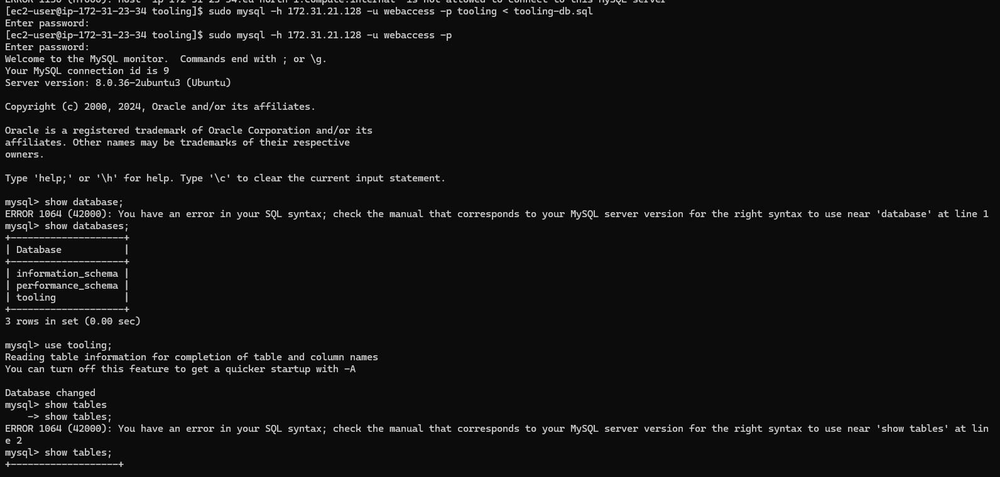

15. Access the website from the webserver ip
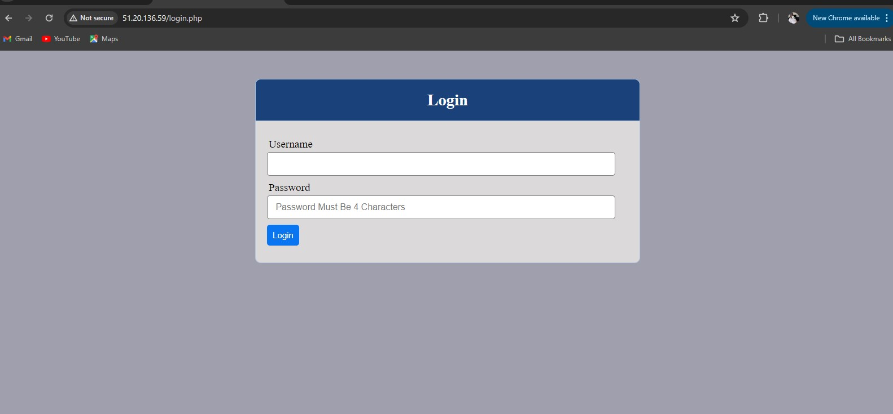
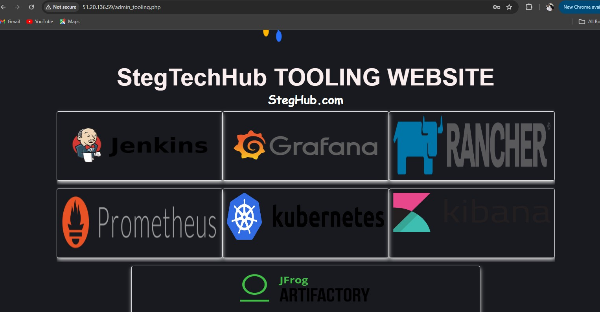

server 2
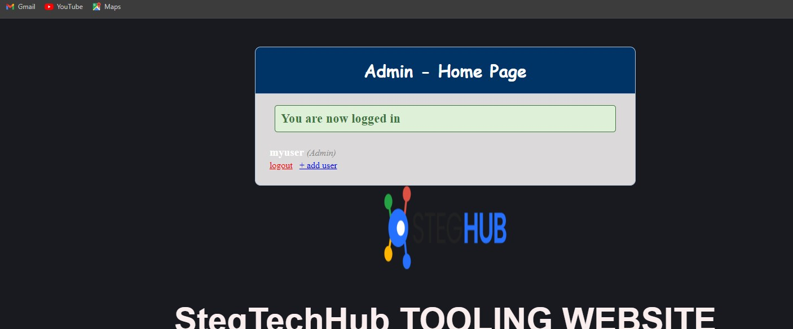