# WEB STACK IMPLEMENTATION (LEMP STACK)
### Introduction
The LEMP software stack is a group of software that can be used to serve dynamic web pages and web applications written in PHP. This is an acronym that describes a Linux operating system, with an Nginx (pronounced like “Engine-X”) web server. The backend data is stored in the MySQL database and the dynamic processing is handled by PHP.  
The primary difference between LAMP and LEMP is the choice of web server software: Apache in LAMP and Nginx in LEMP. While Apache and Nginx serve similar purposes, they have different architectures and approaches to handling web requests, leading to differences in performance and configuration options.

##### Prerequisites
During the LAMP project, an AWS account was established, and instance launching was learned. For the LEMP project, a new EC2 instance was created, utilizing the t3.micro family with Ubuntu Server 24.04LTS (HVM) and allowing traffic from ports 80 (HTTP), 443 (HTTPS), and 22 (SSH) from anywhere globally. While Windows Terminal was utilized to connect to the EC2 instance in the LAMP project, Git Bash was opted for in this project.
##### Step 1: Installing the Nginx web server
1. Using 'apt', The server's package index was first updated and then the nginx was installed.
```
sudo apt update
sudo apt upgrade -y
```
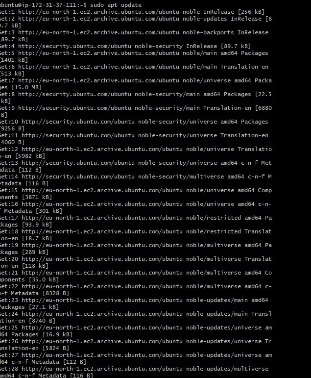
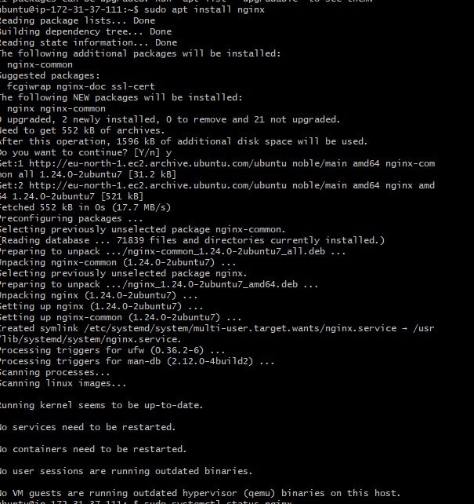
2. To verify that the Nginx was successfully installed and its running on ubuntu
```
sudo systemctl status nginx
```
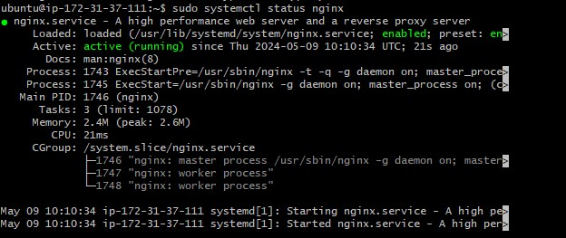
This indicates that the server is active and running.  
3. To check if the active server can be accessed locally, we run
```
curl http://127.0.0.1:80
```
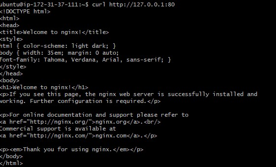
The output is an html template which indicates response to curl command by the nginx server.  
4. 
Next, a test was conducted to determine if the server could respond to requests from the internet by accessing it from a browser using our machine's IP address.
```
http://13.60.83.150:80
```

##### Step 2: Installing mysql
After setting up a server that is up and running, the next step is to choose a database management system to store and manage data from the site. MySQL is a popular relational database management system commonly used in PHP environments. Therefore, MySQL was selected for this project.
1. mysql was installed using 'apt' package
```
sudo apt install mysql-server
```
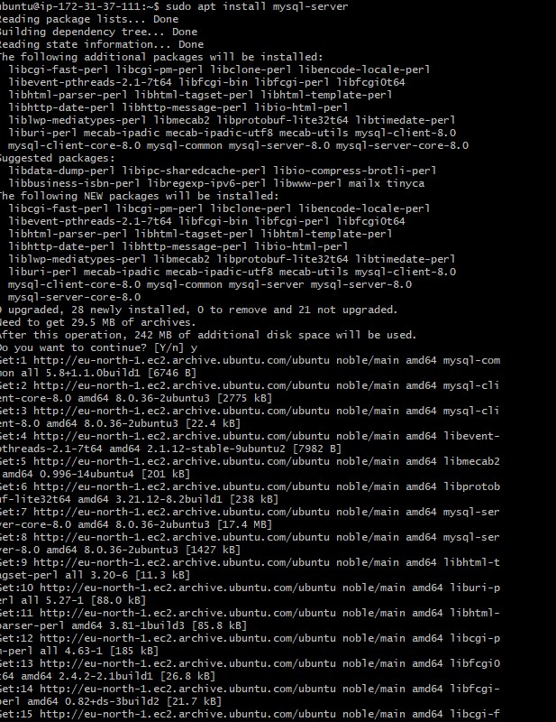
2. After installation, mysql console was logged into
```
sudo mysql
```
Established a password for the root user, utilizing the default authentication method of mysql_native_password, after which the shell was exited.
```
ALTER USER 'root'@'localhost' IDENTIFIED WITH mysql_native_password BY 'Ademola.1234';
```
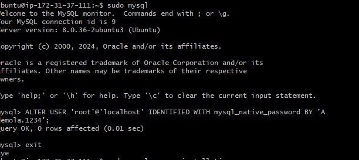
3. ran an interactive script to secure mysql. It returned few security prompts to complete the installation
```
sudo mysql_secure_installation
```
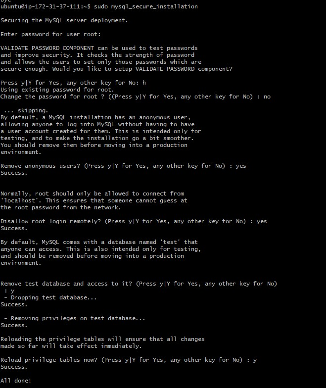
4. When done, the console was logged into to check the changes.
```
sudo mysql -p
```
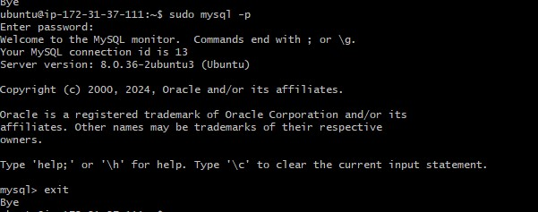
##### step 3: Installing Php
Nginx employs PHP-FPM (PHP FastCGI Process Manager), which operates independently of the Nginx web server. PHP-FPM's separate process architecture allows for more efficient resource management and scalability.  
1. To configure Nginx to route PHP requests to the PHP-FPM software for processing and enable communication with MySQL-based databases, both PHP-FPM and PHP-MySQL were installed using 'apt' package.
```
sudo apt install php-fpm php-mysql -y
```
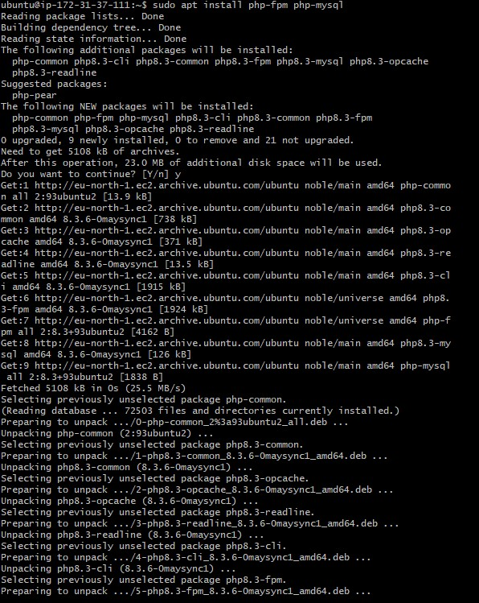
##### Step 4: Configuring Nginx to use PHP processor
1. Created a root web directory for the domain and named it projectLEMP
```
   sudo mkdir /var/www/projectLEMP
```
2. Directory ownership was assigned with $USER which will reference the current system user
```
   sudo chown -R $USER:$USER /var/www/projectLEMP
```
3. A new configuration file was created in Nginx’s “sites-available” directory.
```
    sudo nano /etc/nginx/sites-available/projectLEMP
```
The following bare-bone configuration was edited into the file
```
server {
  listen 80;
  server_name projectLEMP www.projectLEMP;
  root /var/www/projectLEMP;

  index index.html index.htm index.php;

  location / {
    try_files $uri $uri/ =404;
  }

  location ~ \.php$ {
    include snippets/fastcgi-php.conf;
    fastcgi_pass unix:/var/run/php/php8.1-fpm.sock;
  }

  location ~ /\.ht {
    deny all;
  }
}
```
4. The configuration was activated by linking to the config file from Nginx’s sites-enabled directory
```
sudo ln -s /etc/nginx/sites-available/projectLEMP /etc/nginx/sites-enabled/
```
5. Next was to check the configuration for syntax error
```
sudo nginx -t
```
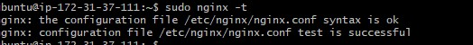
shows that test was successful and there was no error  

6. The default nginx host configured to listen to port 80 was diasabled so that port 80 can be redirected to the created virtual host without conflict.
```
sudo unlink /etc/nginx/sites-enabled/default
```
7. Nginx was reloaded to apply the changes
```
sudo systemctl reload nginx
```
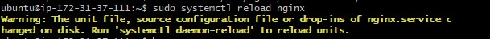
8. With active website, a new html file named 'index.html' was created in the root folder to test if the new server block works as expected.
```
sudo echo ‘Hello LEMP from hostname’ $(curl -s http://169.254.169.254/latest/meta-data/public-hostname) ‘with public IP’ $(curl -s http://169.254.169.254/latest/meta-data/public-ipv4) > /var/www/projectLEMP/index.html
```
9. The Ip address was loaded on a web browser
```
http://30.60.83.150:80
```
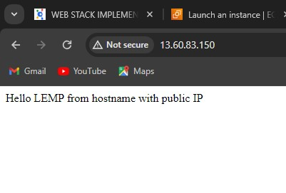

This file can serve as a temporary landing page for the application until an index.php file is configured to replace it. Once the index.php file is set up, it's important to either remove or rename the index.html file from the document root, as it will take precedence over the index.php file by default.
##### Step 5: Testing PHP with Nginx
After a completely installed and operational LEMP stack, it was tested to validate if Nginx can correctly hand ```.php``` files off to PHP processors.
1. To do this, a new php file was opened
```
sudo nano /var/www/projectLEMP/info.php
```
2. A valid php code that will return information about the server was edited into the file.
```
<?php
phpinfo();
```
3. It was then accessed on a web browser using the Ip address
```
http://13.60.83.150:80
```
After checking the relevant information about the server through this page, It’s best to remove the file created as it contains sensitive information about the PHP environment and the ubuntu server. It can always be recreated if the information is needed later.

```
sudo rm /var/www/projectLEMP/info.php
```
##### Step 6: Retrieving Data from MySQL database with PHP
In this step, a test database was created and access was configured to it so that Nginx can query the data and display it.
1. Mysql console was connhected to using the root account
```
sudo mysql -p
```
2. A new database named ```try_database``` was created
```
  CREATE DATABASE try_database;
```
3. A new user ```try_user``` was created and granted the user full permision on the new database.
```
CREATE USER 'try_user'@'%' IDENTIFIED WITH mysql_native_password BY 'Ademola.1234';

GRANT ALL ON try_database.* TO 'try_user'@'%';
```
4. The console was exited after the creation
```
   exit
```
5. The console was logged back into using the set password
```
mysql -u todo_user -p
```
6. Access to the database is confirmed by typing
```
SHOW DATABASES;
```
which displays the database
 

7. A test table was created
```
 CREATE TABLE todo_database.todo_list (
  item_id INT AUTO_INCREMENT,
  content VARCHAR(255),
  PRIMARY KEY(item_id)
);
```
  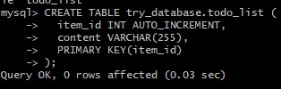

8. Content was inserted into the table
```
INSERT INTO todo_database.todo_list (content) VALUES ("My first item");
```
9. The table was checked for the content
```
SELECT * FROM todo_database.todo_list;
```
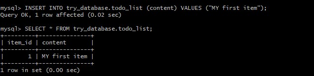

10. The console was then exited
```
Exit
```
11. A PHP script was created to connect to mysql database and query it for its content.
```
sudo nano /var/www/projectLEMP/todo_list.php
```
```
<?php
$user = "todo_user";
$password = "Admin123$";
$database = "todo_database";
$table = "todo_list";

try {
  $db = new PDO("mysql:host=localhost;dbname=$database", $user, $password);
  echo "<h2>TODO</h2><ol>";
  foreach($db->query("SELECT content FROM $table") as $row) {
    echo "<li>" . $row['content'] . "</li>";
  }
  echo "</ol>";
} catch (PDOException $e) {
    print "Error!: " . $e->getMessage() . "<br/>";
    die();
}
?>
```


12. The page was accessed on a browser using the Ip address
```
http://13.60.83.150/todo_list.php
```

### Conclusion

The LEMP stack, comprised of Linux, Nginx, MySQL (or MariaDB), and PHP, offers a powerful and versatile platform for hosting and serving web applications. Linux provides a stable and secure operating system foundation, while Nginx serves as a high-performance web server capable of handling heavy loads and concurrent connections. MySQL or MariaDB serves as the relational database management system, offering robust data storage and management capabilities. PHP, a server-side scripting language, enables dynamic content generation and interaction with databases, making it ideal for building dynamic and interactive web applications. Together, these components form a scalable and reliable environment for deploying web solutions that can meet the demands of modern web development.

