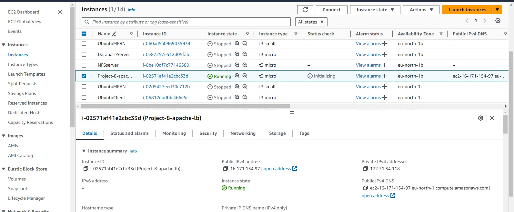
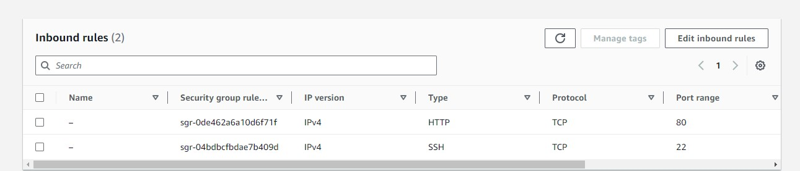
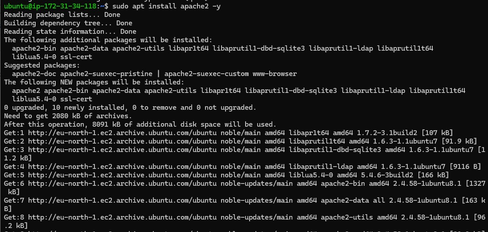
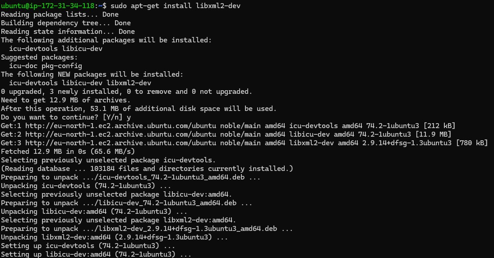
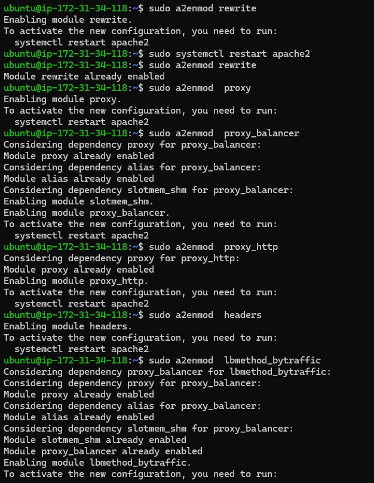
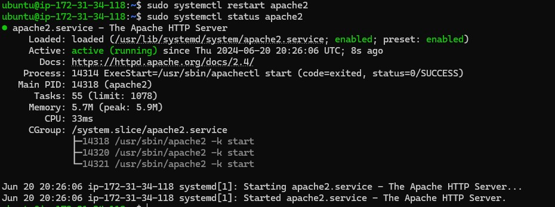
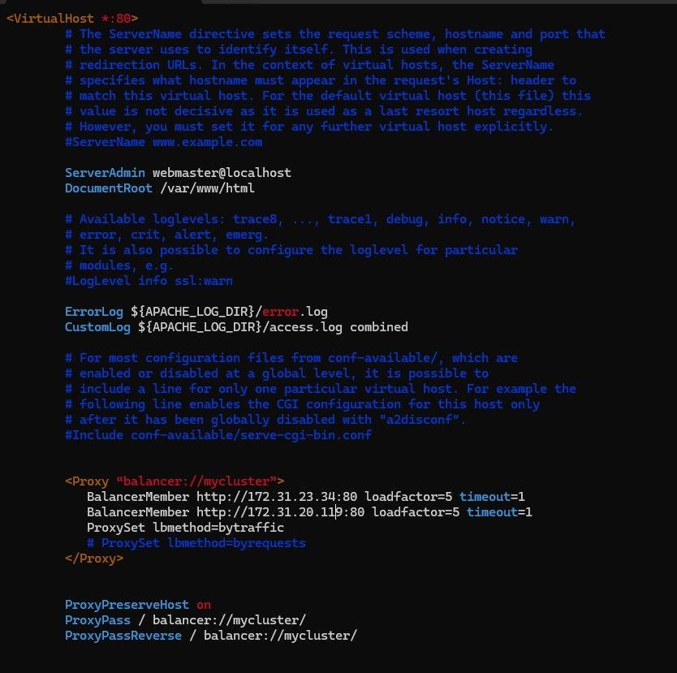
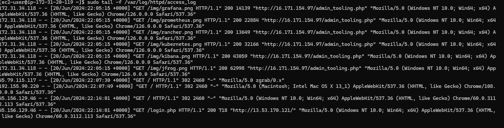
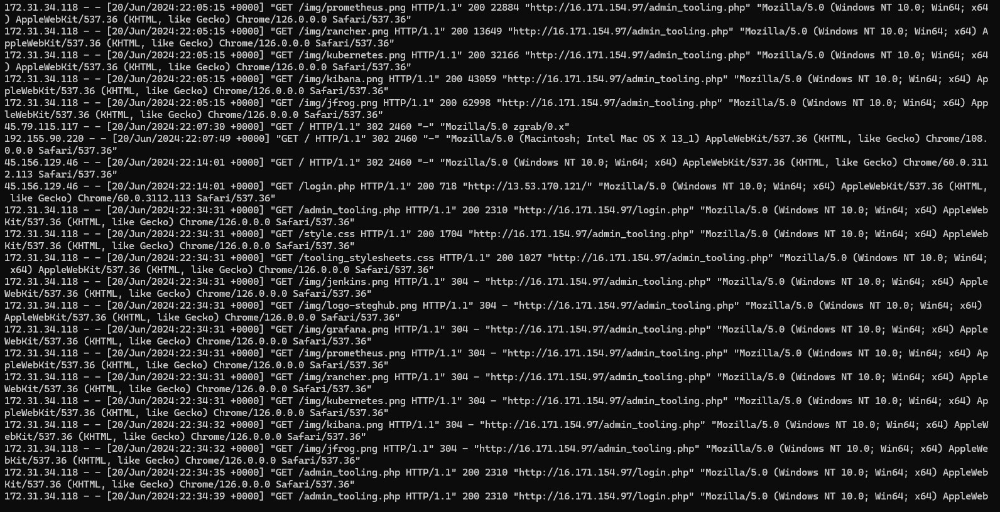

## Load Balancer Solution With Apache
The task is to deploy and configure an Apache Load Balancer for Tooling Website solution on a separate Ubuntu EC2 instance ensuring that users can be served by Web servers through the Load Balancer.

### Prerequisite
* Two RHEL9 Web Servers
* One MySQL DB Server (based on Ubuntu 24.04)
* One RHEL9 NFS Server

### Step 1: Configure Apache As A Load Balancer
1. Create an Ubuntu Server 24.04 EC2 instance and name it Project-8-apache-lb


2. Open TCP port 80 on Project-8-apache-lb by creating an Inbounb Rule in Security Group.


3. Connect to the server, update and upgrade the package index and install Apache.
```
sudo apt install apache2 -y
```
   
```
sudo apt-get install libxml2-dev
```
   

4. Enable the Apache modules
```
sudo a2enmod rewrite

sudo a2enmod  proxy

sudo a2enmod  proxy_balancer

sudo a2enmod  proxy_http

sudo a2enmod  headers

sudo a2enmod  lbmethod_bytraffic
```
   

5. Restart Apache2 service
```
sudo systemctl restart apache2
sudo systemctl status apache2
```
    

6. configure load balancing by editing the file 000-default.conf in sites-available
```
sudo vi /etc/apache2/sites-available/000-default.conf
```
Add to the configuration
```
<Proxy “balancer://mycluster”>
           BalancerMember http://PrivateIPwebserver1:80 loadfactor=5 timeout=1
           BalancerMember http://PrivateIPwebserver2:80 loadfactor=5 timeout=1
           ProxySet lbmethod=bytraffic
           # ProxySet lbmethod=byrequests
</Proxy>


ProxyPreserveHost on
ProxyPass / balancer://mycluster/
ProxyPassReverse / balancer://mycluster/
```
   

7. Restart Apache2 and access the website using the LB's Public IP address or the Public DNS name from a browser


8. Unmount NFS directory

9. Open two ssh consoles for both Web Server and run the command. Refresh the browser page several times and ensure the Web Servers receive HTTP and GET requests.
```
sudo tail -f /var/log/httpd/access_log
```

<<<<<<< HEAD
 

### Conclusion
The mod_proxy_balancer module in Apache HTTP Server provides extensive features for load balancing, such as sticky sessions, health checks, and a range of load balancing algorithms. Configuring these options correctly is crucial for ensuring high availability, scalability, and reliability for web applications.
=======
 


### Conclusion
The mod_proxy_balancer module in Apache HTTP Server provides extensive features for load balancing, such as sticky sessions, health checks, and a range of load balancing algorithms. Configuring these options correctly is crucial for ensuring high availability, scalability, and reliability for web applications.
>>>>>>> ad01943fb10b1e87e92242a3298692bbeaac4757
