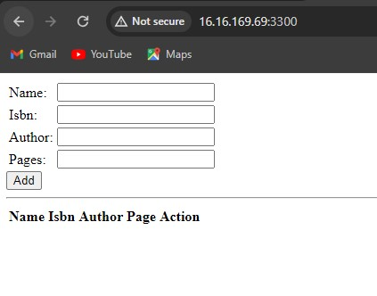

## Deploying a Simple Book Registeration Form using MEAN STACKS ON EC2

### Introduction

The MEAN stack is a popular JavaScript stack used for building web applications, composed of MongoDB, Express.js, AngularJS (or Angular), and Node.js.
* *MongoDB:* MongoDB is a NoSQL database that stores data in a flexible, JSON-like format. It is highly regarded for web applications due to its scalability, flexibility, and performance.
* *Express.js:* Express.js is a web application framework for Node.js that offers a robust set of features for building web applications and APIs. It simplifies the process of developing with Node.js by providing high-level abstractions over the HTTP protocol, including routing, middleware support, and templating engines.
* *AngularJS (or Angular):* AngularJS is a JavaScript framework maintained by Google for building dynamic web applications. It enhances HTML with additional attributes and includes built-in directives for creating interactive user interfaces. Following the Model-View-Controller (MVC) architecture, AngularJS helps organize code effectively, facilitating the development of complex web applications.
* *Node.js:* Node.js is a JavaScript runtime built on Chrome's V8 JavaScript engine, enabling developers to execute JavaScript code outside a web browser. This makes it possible to build server-side applications with JavaScript. Node.js is renowned for its event-driven, non-blocking I/O model, which is ideal for creating scalable and high-performance web applications.

### Step 1: Create and connect to instance
1. Launch EC2 Instance of t3.small type and Ubuntu 22.04 LTS (HVM) us-east-1 region using the AWS console.

2. The security group was configured with the following inbound rules:
* Allow traffic on port 80 (HTTP) with source from anywhere on the internet.
* Allow traffic on port 443 (HTTPS) with source from anywhere on the internet.
* Allow traffic on port 22 (SSH) with source from any IP address. This is opened by default.
* Allow traffic on port 3300 (Custom TCP) with source from anywhere.

3. Open terminal and connect to the instance using:
```
ssh -i "fola25.pem" ubuntu@16.16.169.69
```
### Step 2: Setup Nodejs
1. Update and upgrade list of packages in package manager.
```
sudo apt update
sudo apt upgrade -y
```


2. Add certificates
```
sudo apt -y install curl dirmngr apt-transport-https lsb-release ca-certificates
```


```
curl -sL https://deb.nodesource.com/setup_18.x | sudo -E bash -
```


3. Install Nodejs
```
sudo apt-get install -y nodejs
```


### Step 3: MongoDB setup
1. To start with this application, Book records are added to MongoDB, containing details such as the book name, ISBN number, author, and the number of pages.
Download the MongoDB public GPG key:
```
wget -qO - https://www.mongodb.org/static/pgp/server-4.4.asc | sudo apt-key add -
```
This command retrieves the GPG key for MongoDB and adds it to your system's list of trusted keys, ensuring secure installation of MongoDB packages.  

2. Add the MongoDB repository:
```
echo "deb [ arch=amd64,arm64 ] https://repo.mongodb.org/apt/ubuntu focal/mongodb-org/6.0 multiverse" | sudo tee /etc/apt/sources.list.d/mongodb-org-6.0.list
```

3. Update the package database and install MongoDB
```
sudo apt-get update
```

```
sudo apt-get install -y mongodb-org
```
  

4. Start and enable MongoDB
```
sudo systemctl start mongod
sudo systemctl enable mongod
sudo systemctl status mongod
```
  

5. To process JSON files passed in requests to the server, you need to install the body-parser package.
```
sudo npm install body-parser
```
 

6. Create root folder for the project and open it
```
mkdir Books
cd Books
```

7. initialize the directory
```
npm init
```
 

8. Add a file named ```server.js``` into the directory.
```
vi server.js
```
edit:
```
const express = require('express');
const bodyParser = require('body-parser');
const mongoose = require('mongoose'); // Make sure mongoose is installed and required
const path = require('path'); // To handle static file serving
const app = express();

// Connect to MongoDB
mongoose.connect('mongodb://localhost:27017/test', { useNewUrlParser: true, useUnifiedTopology: true })
  .then(() => console.log('MongoDB connected'))
  .catch(err => console.error('MongoDB connection error:', err));

// Middleware
app.use(bodyParser.json());
app.use(express.static(path.join(__dirname, 'public')));

// Routes
require('./apps/routes')(app);

// Start the server
app.set('port', 3300);
app.listen(app.get('port'), () => {
  console.log('Server up: http://localhost:' + app.get('port'));
});
```

### Step 4: Install Express and set up routes to the server
Express was used to handle the routing and communication of book information to and from our MongoDB database. To model the application data in a structured way, the Mongoose package was utilized. Mongoose provides a straightforward schema-based solution, allowing us to define and enforce a schema for the database, which stores the data of the book register.
1. Install express and mongoose
```
sudo npm install express mongoose
```


2. Create a folder ```apps``` in the ```books``` directory. open it and create a file ```routes.js```
```
mkdir apps
cd apps
vi routes.js
```
edit:
```
const Book = require('./models/book');
const path = require('path');

module.exports = function(app) {
  // Get all books
  app.get('/book', async (req, res) => {
    try {
      const books = await Book.find({});
      res.json(books);
    } catch (err) {
      console.error(err);
      res.status(500).json({ error: 'Internal Server Error' });
    }
  });

  // Add a new book
  app.post('/book', async (req, res) => {
    try {
      const book = new Book({
        name: req.body.name,
        isbn: req.body.isbn,
        author: req.body.author,
        pages: req.body.pages
      });
      const result = await book.save();
      res.json({
        message: "Successfully added book",
        book: result
      });
    } catch (err) {
      console.error(err);
      res.status(500).json({ error: 'Internal Server Error' });
    }
  });

  // Update a book
  app.put('/book/:isbn', async (req, res) => {
    try {
      const updatedBook = await Book.findOneAndUpdate(
        { isbn: req.params.isbn },
        req.body,
        { new: true }
      );
      if (!updatedBook) {
        return res.status(404).json({ error: 'Book not found' });
      }
      res.json({
        message: "Successfully updated the book",
        book: updatedBook
      });
    } catch (err) {
      console.error(err);
      res.status(500).json({ error: 'Internal Server Error' });
    }
  });

  // Delete a book
  app.delete('/book/:isbn', async (req, res) => {
    try {
      const result = await Book.findOneAndRemove({ isbn: req.params.isbn });
      if (!result) {
        return res.status(404).json({ error: 'Book not found' });
      }
      res.json({
        message: "Successfully deleted the book",
        book: result
      });
    } catch (err) {
      console.error(err);
      res.status(500).json({ error: 'Internal Server Error' });
    }
  });

  // Serve static files
  app.get('*', (req, res) => {
    res.sendFile(path.join(__dirname, '../public', 'index.html'));
  });
};
```

3. In the folder ```apps```, create a folder ```models``` and open ```book.js``` in it
```
mkdir models
cd models
vi book.js
```
edit:
```
const mongoose = require('mongoose');

const bookSchema = new mongoose.Schema({
  name: { type: String, required: true },
  isbn: { type: String, required: true, unique: true },
  author: { type: String, required: true },
  pages: { type: Number, required: true }
});

module.exports = mongoose.model('Book', bookSchema);
```

### Step 5: Access the routes with AngularJs
1. In the ```Books``` directory, create a folder ```public```  and open a file ```script.js``` in it
```
mkdir public
cd public
vi script.js
```
Edit
```
var app = angular.module('myApp', []);

app.controller('myCtrl', function($scope, $http) {
  // Get all books
  function getAllBooks() {
    $http({
      method: 'GET',
      url: '/book'
    }).then(function successCallback(response) {
      $scope.books = response.data;
    }, function errorCallback(response) {
      console.log('Error: ' + response.data);
    });
  }

  // Initial load of books
  getAllBooks();

  // Add a new book
  $scope.add_book = function() {
    var body = {
      name: $scope.Name,
      isbn: $scope.Isbn,
      author: $scope.Author,
      pages: $scope.Pages
    };
    $http({
      method: 'POST',
      url: '/book',
      data: body
    }).then(function successCallback(response) {
      console.log(response.data);
      getAllBooks();  // Refresh the book list
      // Clear the input fields
      $scope.Name = '';
      $scope.Isbn = '';
      $scope.Author = '';
      $scope.Pages = '';
    }, function errorCallback(response) {
      console.log('Error: ' + response.data);
    });
  };

  // Update a book
  $scope.update_book = function(book) {
    var body = {
      name: book.name,
      isbn: book.isbn,
      author: book.author,
      pages: book.pages
    };
    $http({
      method: 'PUT',
      url: '/book/' + book.isbn,
      data: body
    }).then(function successCallback(response) {
      console.log(response.data);
      getAllBooks();  // Refresh the book list
    }, function errorCallback(response) {
      console.log('Error: ' + response.data);
    });
  };

  // Delete a book
  $scope.delete_book = function(isbn) {
    $http({
      method: 'DELETE',
      url: '/book/' + isbn
    }).then(function successCallback(response) {
      console.log(response.data);
      getAllBooks();  // Refresh the book list
    }, function errorCallback(response) {
      console.log('Error: ' + response.data);
    });
  };
});
```

2. Create a file ```index.html``` in the ```public``` folder
```
vi index.html
```
Edit:  
```
<!DOCTYPE html>
<html ng-app="myApp" ng-controller="myCtrl">
<head>
  <script src="https://ajax.googleapis.com/ajax/libs/angularjs/1.6.4/angular.min.js"></script>
  <script src="script.js"></script>
  <style>
    /* Add your custom CSS styles here */
  </style>
</head>
<body>
  <div>
    <table>
      <tr>
        <td>Name:</td>
        <td><input type="text" ng-model="Name"></td>
      </tr>
      <tr>
        <td>Isbn:</td>
        <td><input type="text" ng-model="Isbn"></td>
      </tr>
      <tr>
        <td>Author:</td>
        <td><input type="text" ng-model="Author"></td>
      </tr>
      <tr>
        <td>Pages:</td>
        <td><input type="number" ng-model="Pages"></td>
      </tr>
    </table>
    <button ng-click="add_book()">Add</button>
    <div ng-if="successMessage">{{ successMessage }}</div>
    <div ng-if="errorMessage">{{ errorMessage }}</div>
  </div>
  <hr>
  <div>
    <table>
      <tr>
        <th>Name</th>
        <th>Isbn</th>
        <th>Author</th>
        <th>Page</th>
        <th>Action</th>
      </tr>
      <tr ng-repeat="book in books">
        <td>{{ book.name }}</td>
        <td>{{ book.isbn }}</td>
        <td>{{ book.author }}</td>
        <td>{{ book.pages }}</td>
        <td><button ng-click="del_book(book)">Delete</button></td>
      </tr>
    </table>
  </div>
</body>
</html>
```

3. Change directory back to ```Books``` ans start server
```
node server.js
```


4. load the host on a browser


### Conclusion
The MEAN stack, consisting of MongoDB, Express.js, AngularJS (or Angular), and Node.js, offers a powerful and cohesive set of technologies for building modern web applications.

These technologies enable developers to use JavaScript across the entire development process, from front-end to back-end, fostering a unified and efficient development workflow.