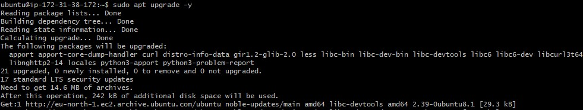
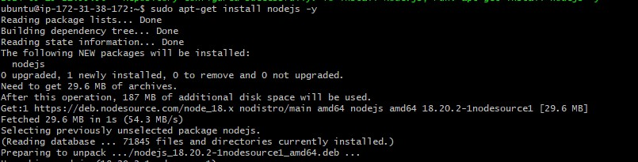
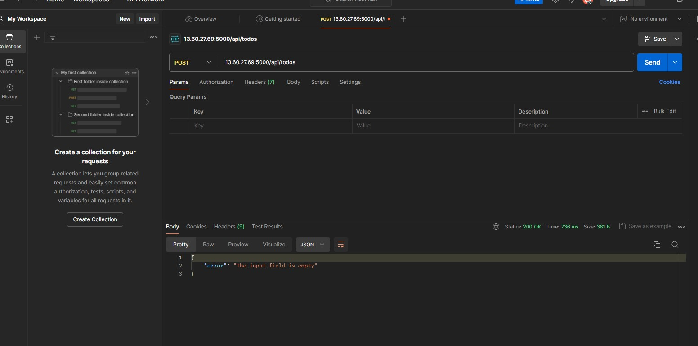

## MERN WEB STACK IMPLEMENTATION IN AWS
The MERN stack, comprised of MongoDB, Express.js, React, and Node.js, is a powerful JavaScript-based technology stack for building modern web applications. MongoDB serves as the NoSQL database, offering flexibility and scalability for storing data in JSON-like documents. Express.js provides a robust web application framework for Node.js, simplifying server-side development with features like routing and middleware support. React, a JavaScript library for building user interfaces, enables the creation of dynamic and interactive front-end experiences through its component-based architecture. Node.js, as the JavaScript runtime environment, executes server-side code and facilitates the development of scalable and high-performance web applications. Together, the MERN stack empowers developers to build feature-rich, real-time web applications efficiently, making it a popular choice across various industries and use cases.

### Step 0: Prerequisites
* A new EC2 instance has been created, utilizing the t3.micro family and running Ubuntu Server 24.04LTS (HVM).
  
* The security group associated with the instance has been set up with specific inbound rules: allowing HTTP traffic on port 80 and HTTPS traffic on port 443 from anywhere on the internet, permitting SSH access on port 22 from any IP address, and also enabling custom TCP traffic on ports 5000 and 3000 from any source. These configurations ensure that the instance is accessible for web traffic and SSH connections, along with accommodating custom TCP-based services.
  
* The private SSH key was used to establish a connection to the instance.
  ```
  ssh -i fola25.pem ubuntu@13.60.27.69
  ```
  

### Step 1 - Backend Configuration
1. Update and upgrade the server’s package index
   ```
   sudo apt update
   sudo apt upgrade -y
   ```

  

2. The installation location of Node.js software was retrieved from the Ubuntu repositories.
```
curl fsSL https://deb.nodesource.com/setup_18.x | sudo -E bash -
```
  

3. Install Node.js and NPM which is a package manager for Node just as apt is a package manager for Ubuntu. It is used to install Node modules and packages and to manage dependency conflicts.
   ```
   sudo apt-get install nodejs -y
   ```
  

4. Verify installation
   ```
   node -v        # Gives the node version
   npm -v        # Gives the node package manager version
   ```
  

###  Step 2: Application code set up
1. Create a new directory for the TO-DO project and switch to it. Then initialize the project directory.
```
mkdir Todo
ls
cd Todo
npm init
```
To initialize the project directory, execute the command. It will generate a new file named package.json, which stores details about your application and its required dependencies. Follow the prompts that appear after running the command. You can press "Enter" multiple times to accept default values. Finally, confirm the creation of the package.json file by typing "yes."
 

### Step 3: ExpressJs installation
Express is a Node.js framework designed to streamline development by abstracting many low-level details. It simplifies tasks such as defining routes for your application based on HTTP methods and URLs.  
1. Install Express using npm
   ```
   npm install express
   ```
  

2. Create a file ```index.js``` and run ```ls``` to confirm the file.
```
touch index.js
ls
```
  

3. Install dotenv module
```
npm install dotenv
```
  

4. Open ```index.js``` file
   ```
   vim index.js
   ```
5. edit with
```
const express = require('express');
require('dotenv').config();

const app = express();

const port = process.env.PORT || 5000;

app.use((req, res, next) => {
  res.header("Access-Control-Allow-Origin", "*");
  res.header("Access-Control-Allow-Headers", "Origin, X-Requested-With, Content-Type, Accept");
  next();
});

app.use((req, res, next) => {
  res.send('Welcome to Express');
});

app.listen(port, () => {
  console.log(`Server running on port ${port}`);
});
```

5. Start the server to see if it works. Open your terminal in the same directory as your index.js file. Run
```
node index.js
```
  

6. The EC2 security group has been configured to allow access through port 5000. To access the server, use the public IP followed by the specified port number.
```
http://13.60.27.69:5000
```


### Step 4: Routes
The ToDo application encompasses three essential actions: creating a new task, displaying a list of all tasks, and deleting a completed task. Each task corresponds to a specific endpoint and utilizes distinct standard HTTP request methods: POST, GET, and DELETE. Routes have been established for each task, defining various endpoints that serve as the foundation for the ToDo app's functionality.

1. Create a folder routes, switch to routes directory and create a file api.js. Open the file
```
mkdir routes
cd routes
touch api.js
```

2. Edit into the file
```
const express = require('express');
const router = express.Router();

router.get('/todos', (req, res, next) => {

});

router.post('/todos', (req, res, next) => {

});

router.delete('/todos/:id', (req, res, next) => {

});

module.exports = router;
```

### Step 5: Models
Models in JavaScript-based applications is pivotal for enabling interactivity. Models serve to define the database schema, crucial for delineating the fields stored in each MongoDB document. Essentially, the schema functions as a blueprint for constructing the database, encompassing additional data fields, termed virtual properties, that may not necessarily be stored in the database. To facilitate the creation of schemas and models, Mongoose was installed—a Node.js package that simplifies working with MongoDB.  
1. Change directory back to Todo folder and install mongoose.
```
npm install mongoose
```


2. Create a new folder models, switch to models directory, open a file ```todo.js``` inside models.
```
mkdir models
cd models
vim todo.js
```

3. Edit into ```todo.js```
```
const mongoose = require('mongoose');
const Schema = mongoose.Schema;

// Create schema for todo
const TodoSchema = new Schema({
  action: {
    type: String,
    required: [true, 'The todo text field is required']
  }
});

// Create model for todo
const Todo = mongoose.model('todo', TodoSchema);

module.exports = Todo;
```
4. Navigate to the ```routes``` directory and access the ```api.js``` file. Delete all the existing code inside the file by using the command ```:%d```.
```
vim api.js
```
5. Edit the new code
```
const express = require('express');
const router = express.Router();
const Todo = require('../models/todo');

router.get('/todos', (req, res, next) => {
  // This will return all the data, exposing only the id and action field to the client
  Todo.find({}, 'action')
    .then(data => res.json(data))
    .catch(next);
});

router.post('/todos', (req, res, next) => {
  if (req.body.action) {
    Todo.create(req.body)
      .then(data => res.json(data))
      .catch(next);
  } else {
    res.json({
      error: "The input field is empty"
    });
  }
});

router.delete('/todos/:id', (req, res, next) => {
  Todo.findOneAndDelete({"_id": req.params.id})
    .then(data => res.json(data))
    .catch(next);
});

module.exports = router;
```

### Step 6: MongoDB Database
MongoDB, a cloud-based database management system, consists of two components: mLab and Atlas. Previously, both mLab and Atlas operated as separate cloud databases managed by MongoDB. However, MongoDB acquired mLab in 2018, leading to certain differences between the two services. In November, MongoDB merged mLab and Atlas into a single cloud database platform. Consequently, accessing mLab.com now redirects users to the MongoDB Atlas website.  
1. Register an account on mongodb.com


2. Verify your mail and login


3. Create mongodb cluster. Use Aws for cloud provider and select any region close to you.


4. Allow Access from anywhere to the MongoDB database (Not secure but it is ideal for testing).


5. Create database and collection


6. Connect to the cluster with drivers


7. Change driver to mongoose and copy the connection string


8. Create a file in your ```/Todo``` directory and name it ```.env```, open the file
```
touch .env
vim .env
```

9. Add the connection string to the ```.env``` file to access the database
```
DB = ‘mongodb+srv://<username>:<password>@<network-address>/<dbname>?retryWrites=true&w=majority’
```

10. Update the index.js to reflect the use of .env so that Node.js can connect to the database.
```
vim index.js
```
11. Delete existing content in the file, and update it with the entire code below:
```
const express = require('express');
const bodyParser = require('body-parser');
const mongoose = require('mongoose');
const routes = require('./routes/api');
const path = require('path');
require('dotenv').config();

const app = express();

const port = process.env.PORT || 5000;

// Connect to the database
mongoose.connect(process.env.DB, { useNewUrlParser: true, useUnifiedTopology: true })
  .then(() => console.log(`Database connected successfully`))
  .catch(err => console.log(err));

// Since mongoose promise is deprecated, we override it with Node's promise
mongoose.Promise = global.Promise;

app.use((req, res, next) => {
  res.header("Access-Control-Allow-Origin", "*");
  res.header("Access-Control-Allow-Headers", "Origin, X-Requested-With, Content-Type, Accept");
  next();
});

app.use(bodyParser.json());

app.use('/api', routes);

app.use((err, req, res, next) => {
  console.log(err);
  next();
});

app.listen(port, () => {
  console.log(`Server running on port ${port}`);
});
```
12. Start your server using the command
```
node index.js
```


### Step 7: Testing Backend Code without Frontend using RESTful API
Postman was employed to assess the backend code, particularly testing the endpoints. In cases where the endpoints necessitated a request body, JSON payloads containing the requisite fields were dispatched, aligning with the configured expectations in the code.

1. Open Postman and Set the header
```
http://13.60.27.69:5000/api/todos
```


2. Create POST requests to the API



3. Make a GET requests to the API to retrieves all existing records from our To-Do application (backend requests these records from the database and sends us back as a response to GET request).


4. Create a DELETE requests to the API using the post id


### Step 8: Frontend Creation
It's time to create a user interface for a web client (browser) to interact with the application through the API.
1. In the same root directory as your backend code, which is the ```Todo``` directory, run:
```
npx create-react-app client
```


2. Before testing the react app, the following dependencies needs to be installed in the project root directory.
* Install concurrently. It is used to run more than one command simultaneously from the same terminal window.
```
npm install concurrently --save-dev
```


* Install nodemon. It is used to run and monitor the server. If there is any change in the server code, nodemon will restart it automatically and load the new changes.
```
npm install nodemon --save-dev
```

3. In ```Todo``` folder open the ```package.json``` file, change the script to;
```
"scripts": {
  "start": "node index.js",
  "start-watch": "nodemon index.js",
  "dev": "concurrently \"npm run start-watch\" \"cd client && npm start\""
}
```

4. Configure Proxy In package.json
* Change directory to ```client```
```
cd client
```
* Open the package.json file
```
vim package.json
```
* Add the key value pair in the ```package.json``` file. This is to make it possible to access the application directly from the browser by simply calling the server url like http://locathost:5000 rather than always including the entire path like http://localhost:5000/api/todos
```
“proxy”: “http://localhost:5000”
```
* From the ```Todo directory```, run the code to open the app and run it on localhost 3000 which has been opened on the ec2.
```
npm run dev
```


### Step 9: Creating React Components

One of the advantages of React is its use of components, which are reusable and contribute to modular code. For the Todo app, there are two stateful components and one stateless component.  
1. From the ```Todo``` directory, navigate to the ```client``` directory
```
cd client
```
2. Move to the ```src``` directory
```
cd src
```
3. Create a directory named ```components```
```
mkdir components
```
4. Inside the ```components``` directory create three files ```Input.js```, ```ListTodo.js``` and ```Todo.js```.
```
touch Input.js ListTodo.js Todo.js
```
5. Open Input.js file
```
vim Input.js
```
* edit
```
import React, { Component } from 'react';
import axios from 'axios';

class Input extends Component {
  state = {
    action: ""
  }

  handleChange = (event) => {
    this.setState({ action: event.target.value });
  }

  addTodo = () => {
    const task = { action: this.state.action };

    if (task.action && task.action.length > 0) {
      axios.post('/api/todos', task)
        .then(res => {
          if (res.data) {
            this.props.getTodos();
            this.setState({ action: "" });
          }
        })
        .catch(err => console.log(err));
    } else {
      console.log('Input field required');
    }
  }

  render() {
    let { action } = this.state;
    return (
      <div>
        <input type="text" onChange={this.handleChange} value={action} />
        <button onClick={this.addTodo}>add todo</button>
      </div>
    );
  }
}

export default Input;
```
6. To make use of Axios, which is a Promise based HTTP client for the browser and node.js, install ```axios``` in the ```client``` folder.
```
npm install axios
```
7. Navigate to ```/src/components``` and open ```ListTodo.js```. Edit the code:
```
import React from 'react';

const ListTodo = ({ todos, deleteTodo }) => {
  return (
    <ul>
      {
        todos && todos.length > 0 ? (
          todos.map(todo => {
            return (
              <li key={todo._id} onClick={() => deleteTodo(todo._id)}>
                {todo.action}
              </li>
            );
          })
        ) : (
          <li>No todo(s) left</li>
        )
      }
    </ul>
  );
}

export default ListTodo;
```
8. Open ```Todo.js``` file and write in the following code;
```
import React, { Component } from 'react';
import axios from 'axios';

import Input from './Input';
import ListTodo from './ListTodo';

class Todo extends Component {
  state = {
    todos: []
  }

  componentDidMount() {
    this.getTodos();
  }

  getTodos = () => {
    axios.get('/api/todos')
      .then(res => {
        if (res.data) {
          this.setState({
            todos: res.data
          });
        }
      })
      .catch(err => console.log(err));
  }

  deleteTodo = (id) => {
    axios.delete(`/api/todos/${id}`)
      .then(res => {
        if (res.data) {
          this.getTodos();
        }
      })
      .catch(err => console.log(err));
  }

  render() {
    let { todos } = this.state;
    return (
      <div>
        <h1>My Todo(s)</h1>
        <Input getTodos={this.getTodos} />
        <ListTodo todos={todos} deleteTodo={this.deleteTodo} />
      </div>
    );
  }
}

export default Todo;
```

9. The react code needs a little adjustment. Navigate to ```src``` folder and open the ```App.js``` file. Edit the following code into it:
```
import React from 'react';
import Todo from './components/Todo';
import './App.css';

const App = () => {
  return (
    <div className="App">
      <Todo />
    </div>
  );
}

export default App;
```
10. From the ```src``` folder, open the ```App.css``` file and put the following code in it:
```
.App {
  text-align: center;
  font-size: calc(10px + 2vmin);
  width: 60%;
  margin-left: auto;
  margin-right: auto;
}

input {
  height: 40px;
  width: 50%;
  border: none;
  border-bottom: 2px #101113 solid;
  background: none;
  font-size: 1.5rem;
  color: #787a80;
}

input:focus {
  outline: none;
}

button {
  width: 25%;
  height: 45px;
  border: none;
  margin-left: 10px;
  font-size: 25px;
  background: #101113;
  border-radius: 5px;
  color: #787a80;
  cursor: pointer;
}

button:focus {
  outline: none;
}

ul {
  list-style: none;
  text-align: left;
  padding: 15px;
  background: #171a1f;
  border-radius: 5px;
}

li {
  padding: 15px;
  font-size: 1.5rem;
  margin-bottom: 15px;
  background: #282c34;
  border-radius: 5px;
  overflow-wrap: break-word;
  cursor: pointer;
}

@media only screen and (min-width: 300px) {
  .App {
    width: 80%;
  }

  input {
    width: 100%;
  }

  button {
    width: 100%;
    margin-top: 15px;
    margin-left: 0;
  }
}

@media only screen and (min-width: 640px) {
  .App {
    width: 60%;
  }

  input {
    width: 50%;
  }

  button {
    width: 30%;
    margin-left: 10px;
    margin-top: 0;
  }
}
```

11. Open the ```index.css``` folder and edit:
```
body {
  margin: 0;
  padding: 0;
  font-family: -apple-system, BlinkMacSystemFont, "Segoe UI", "Roboto", "Oxygen", "Ubuntu", "Cantarell", "Fira Sans", "Droid Sans", "Helvetica Neue", sans-serif;
  -webkit-font-smoothing: antialiased;
  -moz-osx-font-smoothing: grayscale;
  box-sizing: border-box;
  background-color: #282c34;
  color: #787a80;
}

code {
  font-family: source-code-pro, Menlo, Monaco, Consolas, "Courier New", monospace;
}
```
12. move back to the ```Todo``` directory and run:
```
npm run dev
```


### Conclusion
By following this documentation and utilizing the provided resources, you will be well-equipped to build and deploy fully-fledged web applications using the MERN stack.