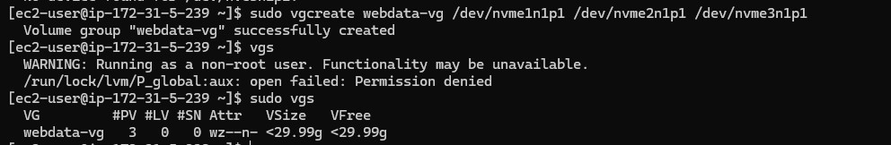
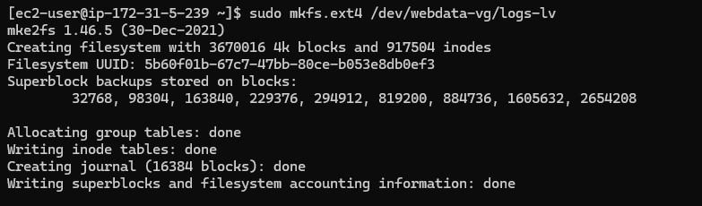

# Web Solution With WordPress
### Step 1: Prepare a server for web
1. Launch a RedHat EC2 instance that serve as Web Server. Create 3 volumes in the same location as the web server ec2 each of 10GB and attach all 3 volumes one by one to the web server.


2. Ssh into Linux terminal to begin configuration.
```
ssh -i fola25.pem ec2-user@13.53.234.22 
```


3. Use ```lsblk``` to check the block devices attached to the server. All devices in Linux reside in ```/dev/``` directory. Inspect with ```ls /dev/``` and ensure all 3 newly created devices are there.
```
lsblk
ls /dev/
```


4. Check all mounts and free space on the server with:
```
df -h
```


5. Create a single partition on each of the 3 disks with ```gdisk``` utility.
```
sudo gdisk /dev/nvme1n1
sudo gdisk /dev/nvme2n1
sudo gdisk /dev/nvme3n1
```


6. Use lsblk utility to view the newly configured partitions on each of the 3 disks
```
lsblk
```


7. Install ```lvm``` package
```
sudo yum install lvm2 -y
``` 


8. Use ```pvcreate``` utility to mark each of the 3 dicks as physical volumes (PVs) to be used by LVM. Verify that each of the volumes have been created successfully.
```
sudo pvcreate /dev/nvme1n1p1 /dev/nvme2n1p1 /dev/nvme3n1p1
sudo pvs
```


9. Use ```vgcreate``` utility to add all 3 PVs to a volume group (VG). Name the VG ```webdata-vg```. Verify that the VG has been created successfully
```
sudo vgcreate webdata-vg /dev/nvme1n1p1 /dev/nvme2n1p1 /dev/nvme3n1p1
sudo vgs
```


10. Use ```lvcreate``` utility to create 2 logical volume, ```apps-lv``` (Use half of the PV size), and ```logs-lv``` (Use the remaining space of the PV size). Verify that the logical volumes have been created successfully.

Note: ```apps-lv``` is used to store data for the Website while ```logs-lv``` is used to store data for logs.
```
sudo lvcreate -n apps-lv -L 14G webdata-vg
sudo lvcreate -n logs-lv -L 14G webdata-vg
sudo lvs
```


11. Verify setup
```
sudo vgdisplay -v
sudo lsblk
```


12. Use``` mkfs.ext4``` to format the logical volumes with ext4 filesystem.
```
sudo mkfs.ext4 /dev/webdata-vg/apps-lv
sudo mkfs.ext4 /dev/webdata-vg/logs-lv
```



13. Create ```/var/www/html``` directory to store website files and ```/home/recovery/logs``` to store backup of log data
```
sudo mkdir -p /var/www/html
sudo mkdir -p /home/recovery/logs
```

14. Mount ```/var/www/html``` on apps-lv logical volume
```
sudo mount /dev/webdata-vg/apps-lv /var/www/html
```

15.  Use ```rsync``` utility to backup all the files in the log directory ```/var/log``` into ```/home/recovery/logs``` (This is required before mounting the file system)
```
sudo rsync -av /var/log /home/recovery/logs
```


16.  Mount ```/var/log``` on logs-lv logical volume (All existing data on ```/var/log``` is deleted with this mount process which was why the data was backed up)
```
sudo mount /dev/webdata-vg/logs-lv /var/log
```

17. Restore log file back into /var/log directory
```
sudo rsync -av /home/recovery/logs/log/ /var/log
```


18. Update ```/etc/fstab``` file so that the mount configuration will persist after restart of the server
```
sudo blkid   # To fetch the UUID
sudo vi /etc/fstab
```


19. Test the configuration and reload daemon. Verify the setup
```
sudo mount -a   # Test the configuration
sudo systemctl daemon-reload
df -h   # Verifies the setup
```


### Step 2: Prepare the Database Server
1. Launch a second RedHat EC2 instance that will have a role - DatabaseServer. Repeat the same steps as for the Web Server, but instead of ```apps-lv```, create ```dv-lv``` and mount it to ```/db``` directory.


### Step 3:  Install WordPress on the Web Server EC2
1. Update the repository
```
sudo yum -y update
```


2. Install wget, Apache and it's dependencies
```
sudo yum -y install wget httpd php php-mysqlnd php-fpm php-json
```


3. To install the latest version of PHP and its dependencies on RHEL 9 using the Remi repository, you will also need to install the EPEL repository. The dnf package manager is recommended for this task, as it offers better performance and more efficient dependency resolution compared to the older yum.
```
sudo dnf install https://dl.fedoraproject.org/pub/epel/epel-release-latest-9.noarch.rpm
```


4. Install yum utils and enable remi-repository
```
sudo dnf install dnf-utils http://rpms.remirepo.net/enterprise/remi-release-9.rpm
```


5. After the successful installation of yum-utils and Remi-packages, search for the PHP modules which are available for download by running the command.
```
sudo dnf module list php
```


6. The output above indicates that if the currently installed version of PHP is PHP 8.1, there is need to install the newer release, PHP 8.2. Reset the PHP modules.
```
sudo dnf module reset php
```


7.  Enable the PHP 8.2 module
```
sudo dnf module enable php:remi-8.2
```


8. Install PHP, PHP-FPM (FastCGI Process Manager) and associated PHP modules and verify the version
```
sudo dnf install php php-opcache php-gd php-curl php-mysqlnd
php -v
```


9. Start, enable and check status of PHP-FPM on boot-up.
```
sudo systemctl start php-fpm
sudo systemctl enable php-fpm
sudo systemctl status php-fpm
```


10. Configure SELinux Policies
```
sudo chown -R apache:apache /var/www/html
sudo chcon -t httpd_sys_rw_content_t /var/www/html -R
sudo setsebool -P httpd_execmem 1
sudo setsebool -P httpd_can_network_connect=1
sudo setsebool -P httpd_can_network_connect_db=1
```

11. Restart Apache web server for PHP to work with Apache web server.
```
sudo systemctl restart httpd
```

12. Test to see the default Apache page on a browser using the public IP address


13. Download wordpress and copy wordpress content to /var/www/html
```
sudo mkdir wordpress
cd wordpress
sudo wget http://wordpress.org/latest.tar.gz
sudo tar xzvf latest.tar.gz
```


14. After extraction, cd into the extracted ```wordpress``` and Copy the content of ```wp-config-sample.php``` to ```wp-config.php```.
```
sudo cp -R wp-config-sample.php wp-config.php
```

15. Exit from the extracted wordpress. Copy the content of the extracted wordpress to ```/var/www/html```.
```
sudo cp -R wordpress/. /var/www/html/
```

### Step 4:  Install MySQL on DB Server EC2
1. Update instance and install MySQL Server
```
sudo yum update -y
sudo yum install mysql-server -y
```

2. Run mysql secure script
```
sudo systemctl start mysqld
sudo mysql_secure_installation
```

3. Create database. The user ```wordpress``` will be connecting to the database using the Web Server private IP address.
```
sudo mysql -u root -p

CREATE DATABASE wordpress_db;
CREATE USER 'wordpress'@'172.31.5.239' IDENTIFIED WITH mysql_native_password BY 'Ademola.1234';
GRANT ALL PRIVILEGES ON wordpress_db.* TO 'wordpress'@'172.31.5.239' WITH GRANT OPTION;
FLUSH PRIVILEGES;
show databases;
exit
```


4. Set the bind address to ```0.0.0.0```
```
sudo vi /etc/my.cnf
sudo systemctl restart mysqld
```

5. Configure WordPress to connect to remote database by opening MySQL port 3306 on the DB Server EC2. For extra security, access to the DB Server is allowed only from the Web Server IP address. In the inbound rule, /32 is configured as source.


6. Install mysql server on the Web Server EC2. WordPress has its own database, therefore it needs a database server to store it's information such as: Username, Email, Passwords, First name and Last name of the users on the wordpress website on a database.
```
sudo yum install mysql-server
sudo systemctl start mysqld
sudo systemctl enable mysqld
sudo systemctl status mysqld
```

7. Open wp-config.php file and edit the database information
```
cd /var/www/html
sudo vi wp-config.php
sudo systemctl restart httpd
```

8. Disable the Apache default page
```
sudo mv /etc/httpd/conf.d/welcome.conf /etc/httpd/conf.d/welcome.conf_backup
```

9. Connect to the DB Server from the Web Server
```
sudo mysql -h 172.31.30.142 -u wordpress -p

show databases;
exit;
```

10. Access the web page again with the Web Server public IP address and install wordpress on the browser


We have successfully implemented wordpress for use